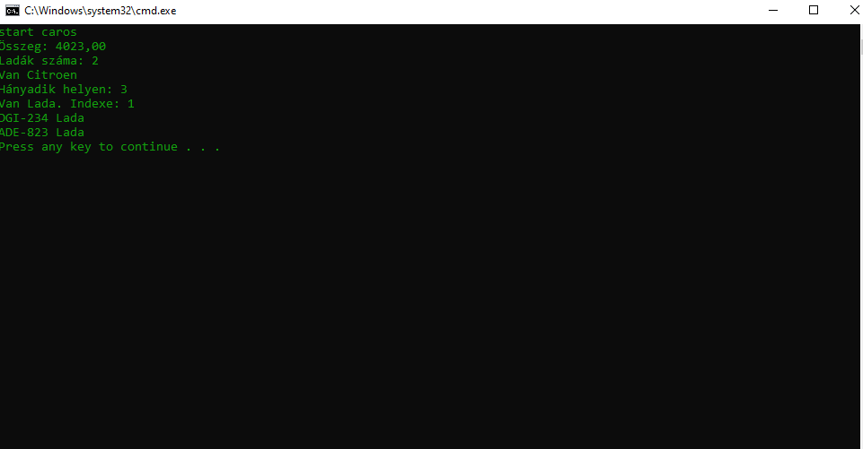

# Felhasználisi dokumetáció

## Az alkalmazás célja 

Az alkalmazás a jármüvek adatait olvassa be a megadott csv formátumo fáljból

## Telepités

A program futtatásához Java futtató környezet szükséges.

A telepitéshez töltse le a caros.zip fájlt, majd csomagolja ki tetszőleges helyre.

## Inditás

A caros könyvtárban talál egy caros.bat nevű fálj. A fáljkezelöben duplakattintással inditható a program

## A program használata

A program betivel nélkül fut.

